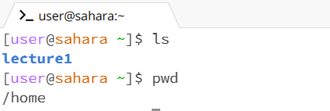

1. When running the command cd with no argument, it did not do much because it did not contain a directory to go to. As well, since I'm in the terminal home it stayed in home. This did not produce an error.

2. When running the command cd with a pathway to a directory using the argument "lecture1", it changed its directory to the folder of my choice. In doing so, "lecture1" has been added to the terminal, this means that now I can interact with the file systems under the specific directory. This did not produce an error.

3. When running the command cd with a pathway to a file using "Hello.class", it produced an error. This is due to the fact that "Hello.class" is a file and the command cd only works to navigate through directories in the terminal as the output states. 

 

4. When running the command ls with no argument, the output showed the directory lecture1. When using ls with no argument, it shows any directories or files in the current directory (/home). Although it shows the directories, it does not nagivate towards the directory like cd so the terminal is still under (/home). There were no errors.

