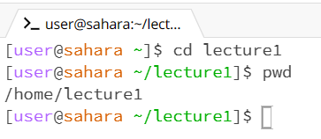
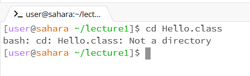

1. When running the command cd with no argument, it did not do much because it did not contain a directory to go to. As well, since I'm in the terminal home it stayed in home. This did not produce an error.

2. When running the command cd with the argument "lecture1" it changed its directory to the folder of my choice. In doing so, "lecture1" has been added to the terminal, this means that now I can interact with the file systems under the specific director. This did not produce an error.

