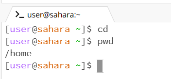

1. When running the command cd with no argument, it did not do much because it did not contain a directory to go to. As well, since I'm in the terminal home it stayed in home. This did not produce an error.
