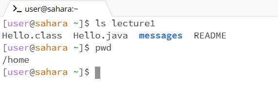
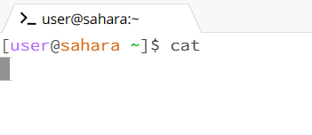

1. When running the command cd with no argument, it did not do much because it did not contain a directory to go to. As well, since I'm in the terminal home it stayed in home. This did not produce an error.

2. When running the command cd with a pathway to a directory using the argument "lecture1", it changed its directory to the folder of my choice. In doing so, "lecture1" has been added to the terminal, this means that now I can interact with the file systems under the specific directory. This did not produce an error.

3. When running the command cd with a pathway to a file using "Hello.class", it produced an error. This is due to the fact that "Hello.class" is a file and the command cd only works to navigate through directories in the terminal as the output states. 

 

4. When running the command ls with no argument, the output showed the directory lecture1. When using ls with no argument, it shows any directories or files in the current directory (/home). Although it shows the directories, it does not nagivate towards the directory like cd so the terminal is still under (/home). There were no errors.

 
5. When running the ls command with a pathway to a directory using "lecture1", the output displayed the names of directories and files under the chosen directory. As well, there are distinct differences that shows what are directories and files. Directories are blue and bold and files are black in normal font. Still the terminal has not changed and its still under (/home). No errors occured.

6. When running the ls command with a pathway to a file using "Hello.java", the output produced the name of the file. This is because ls is used to list the contents names of directories, rather than for files.

 

7. When running the command cat with no argument, the output shows nothing and the terminal changed. This allowed me to add text to the terminal. This was not an error, but was not the expected output I imagined.

 

8. When running the commmand cat with the argument "lecture1" as a pathway to a directory, the output was an error and categorized "lecture1" to be a directory. This is because the command cat only works for files.

9. When running the command cat with the argument "en-us.txt" as a pathway to a file, the output produced the contents of the file. There were no errors
