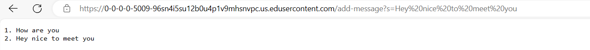

1. The two methods that are being called are main method NumberServer and Handler
2. revelant arguments in these methods is the args in the main method since it contains an element which is relevant to port. string1 in Handle adds and updates the message. And i in Handle increments when a new message is added
3. When making a request to add a message, handleRequest is called. When the path contains /add-message and includes s, the message provided will be added to the string1 ArrayList. The value for i changes too when a new message is added incrementing by 1. 

