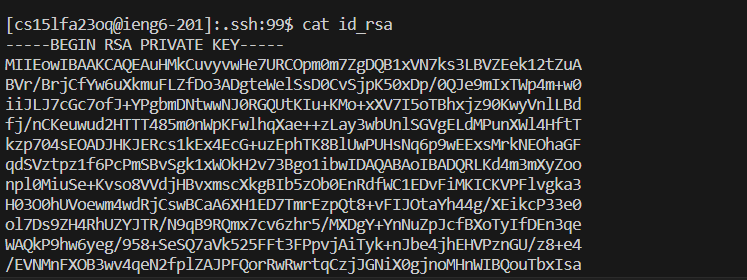
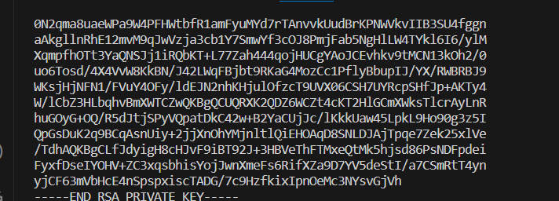
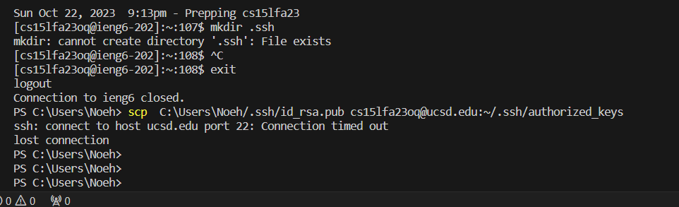
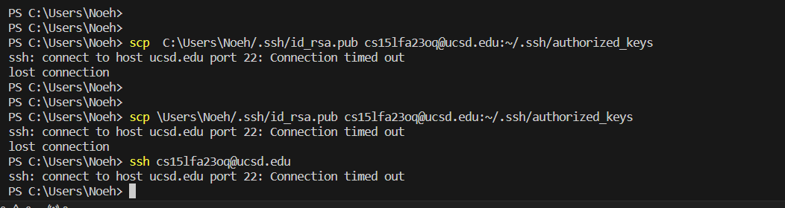

# Part 1

1. The two methods that are being called are main method NumberServer and Handler
2. revelant arguments in these methods is the args in the main method since it contains an element which is relevant to port. string1 in Handle adds and updates the message. And i in Handle increments when a new message is added
3. When making a request to add a message, handleRequest is called. When the path contains /add-message and includes s, the message provided will be added to the string1 ArrayList. The value for i changes too when a new message is added incrementing by 1. 

Part 2

Before this error I was able to log in without a password, and now I wasn't able to even log into my account. 

Part 3

In this labs week 2 and 3 I feel like I've learned alot of new language that I did not know before. Especially when it came to ssh and having to find my public and private keys. As well, a neat way to easily access my accounts without having to put in my password each time. Lastly, being able to produce code that works with URL's was interesting because theres alot of stuff I can do with code that I initially didn't know.
