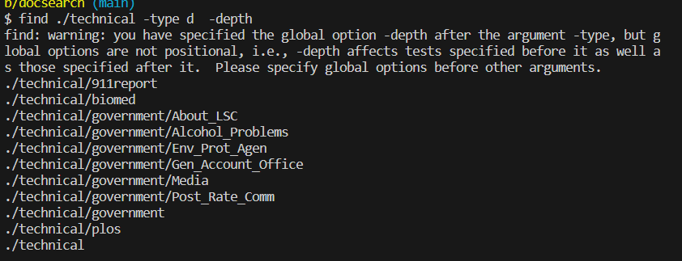
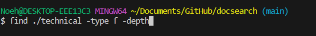
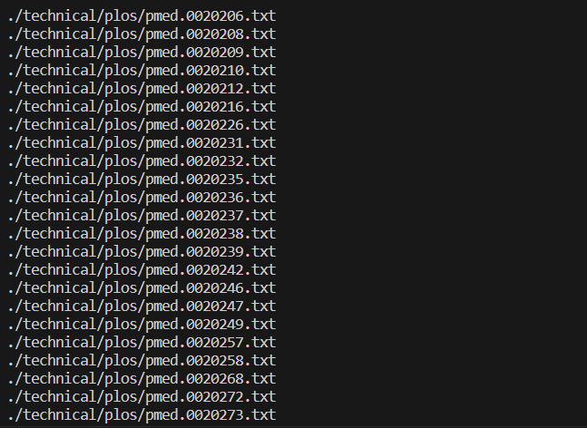

**Part 1**
```
code block
@Test
    public void testReversedUnchangedArray() {
        int[] arr = {1, 2, 3, 4, 5}; // An input array

        ArrayExamples.reversed(arr);

        assertArrayEquals(arr, ArrayExamples.reversed(arr)); 
    }
}
```


**Part 2**

**name option**


Finds all files that have given name command, this is important when I want to find a specific file


Same idea for this code, instead I can use it to find a specific file 

**maxdepth option**


This command finds and limits its depth of how much it travels in a directory when finding directories, its important when i want to see how many directories are in given depth 


This command finds and limits its depth of how much it travels in a directory when finding files, its important when I want to see how many files are in given depth 


**type option**


This code is finding all file types in the technical directory, its important because Im able to easily access all types of files.


This code is finding all file types in the technical directory, its important because Im able to easily access all types of files.


This code is finding all dictionary tupes in the technical directory, its important because I can easily acces all dictionary in the given command I provide.

**Depth option**



using this command will reverse the order of how the directories are being processed from bottom up, which is important to be able to custumize and control the order to prevent loops






using this command will reverse the order of how it proccessed which uses the contents of the directory before the directory itself. Its important because it allows for controlling the order.
