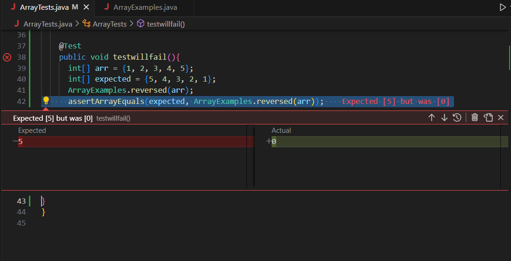
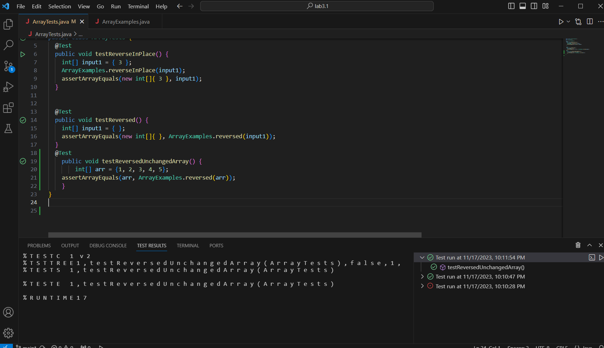

**Part 1**
```
 @Test
    public void testwillfail(){
      int[] arr = {1, 2, 3, 4, 5}; 
      int[] expected = {5, 4, 3, 2, 1};    
      ArrayExamples.reversed(arr);
    assertArrayEquals(expected,ArrayExamples.reversed(arr));
}

```
```

@Test
    public void testReversedUnchangedArray() {
        int[] arr = {1, 2, 3, 4, 5}; 
    assertArrayEquals(arr, ArrayExamples.reversed(arr)); 
    }
}
```





```
  static int[] reversed(int[] arr) {
    int[] newArray = new int[arr.length];
    for(int i = 0; i < arr.length; i += 1) {
      arr[i] = newArray[arr.length - i - 1];
    }
    return arr;
  }
```

```
 static int[] reversed(int[] arr) {
    int[] newArray = new int[arr.length];
    for(int i = 0; i < arr.length; i += 1) {
      newArray[i] = arr[arr.length - i - 1];
    }
    return newArray;
  }
```
The issue with the initial code is that rather than copying the elements from arr, it was copying the elements from newArray which its values contained 0's. As well, returning arr instead of the newArray. In order to this issue I assigned the reversed values to the "newArray" and then make it return the newArray rather than the original. 


**Part 2**

**name option**


```$ find ./technical -name "rr74.txt" 
./technical/biomed/rr74.txt
```

Finds all files that have given name command, this is important when I want to find a specific file


Same idea for this code, instead I can use it to find a specific file 

**maxdepth option**


This command finds and limits its depth of how much it travels in a directory when finding directories, its important when i want to see how many directories are in given depth 


This command finds and limits its depth of how much it travels in a directory when finding files, its important when I want to see how many files are in given depth 


**type option**


This code is finding all file types in the technical directory, its important because Im able to easily access all types of files.


This code is finding all file types in the technical directory, its important because Im able to easily access all types of files.


This code is finding all dictionary tupes in the technical directory, its important because I can easily acces all dictionary in the given command I provide.

**Depth option**


using this command will reverse the order of how the directories are being processed from bottom up, which is important to be able to custumize and control the order to prevent loops


using this command will reverse the order of how it proccessed which uses the contents of the directory before the directory itself. Its important because it allows for controlling the order.

sources chatgpt
I asked chatgbt to provide command examples of find and give me a description of how these commands work. 

here are the outputs it provided me with

I asked it to show me an example of using the command find when searching for a file name 

```
find /path/to/search -type f -name "filename.txt"
```

here I asked to show me what maxdepth 1 and 2 do and to show me exmaples of its use

```
1. -maxdepth 1 (Search within the current directory only):

When you use -maxdepth 1, the search is limited to the current directory, and it won't traverse into any subdirectories.
Only files and directories within the starting directory itself are considered in the search.
Example:
Suppose you have the following directory structure:

bash
Copy code
/mydir/
  ├── file1.txt
  ├── subdirectory1/
  │     ├── file2.txt
  ├── subdirectory2/
  │     ├── file3.txt
If you run the command:

bash
Copy code
find /mydir -maxdepth 1 -type f -name "file2.txt"
The search will be limited to /mydir and will only consider files within that directory (not in its subdirectories). It will find file1.txt, but it won't find file2.txt because it's in a subdirectory.

2. -maxdepth 2 (Search within the current directory and its immediate subdirectories):

With -maxdepth 2, the search includes the current directory and its immediate subdirectories, up to a depth of 2 levels.
Files and directories within these directories are considered in the search.
Example:
Using the same directory structure as before:

bash
Copy code
/mydir/
  ├── file1.txt
  ├── subdirectory1/
  │     ├── file2.txt
  ├── subdirectory2/
  │     ├── file3.txt
If you run the command:

bash
Copy code
find /mydir -maxdepth 2 -type f -name "file2.txt"
```
as well for type I asked it the similar format of questions 

```
The -type option in the find command is used to specify the type of files or directories you want to search for. It allows you to filter your search based on the file type. Here's how it's used:

bash
Copy code
find /path/to/search -type type_flag
find: The find command itself.
/path/to/search: Replace this with the actual path to the directory where you want to start your search.
-type type_flag: Specifies the type of file or directory you want to search for. The type_flag can be one of the following options:
f: Regular files.
d: Directories.

```

lastly I asked for it to show me the depth command and how it can be used 
```

The -depth option in the find command is used to control the order in which directories and their contents are processed during a search. It affects the depth-first traversal of the directory structure. Here's how it's used:

bash
Copy code
find /path/to/search -type f -depth
find: The find command itself.
/path/to/search: Replace this with the actual path to the directory where you want to start your search.
-type f: Specifies that you are looking for regular files (not directories or other file types).
-depth: This option tells find to process directories and their contents in a bottom-up manner, meaning it processes the contents of a directory before processing the directory itself.
```


