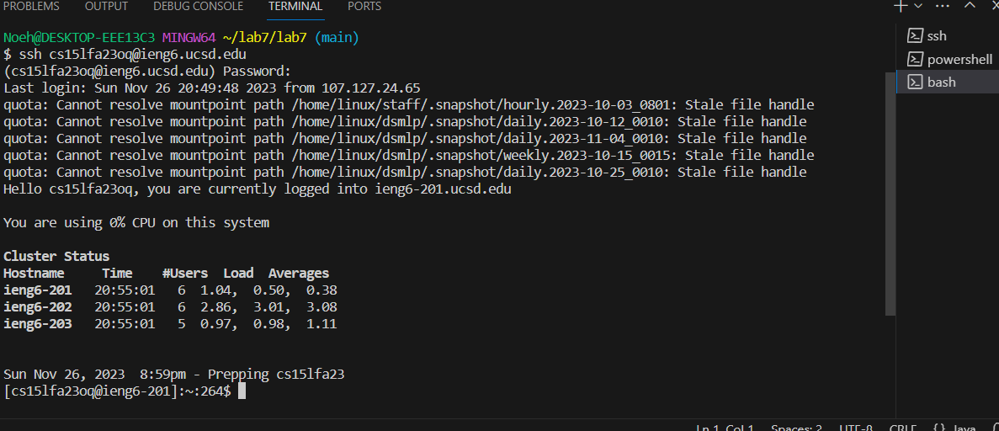
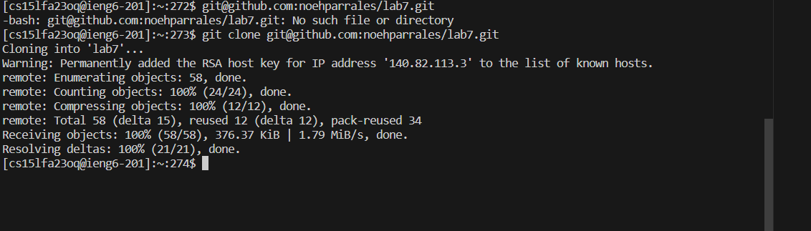
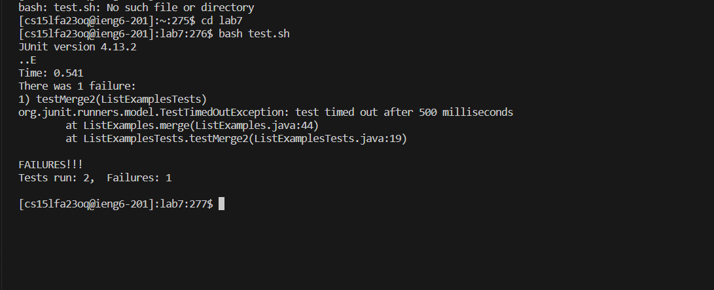
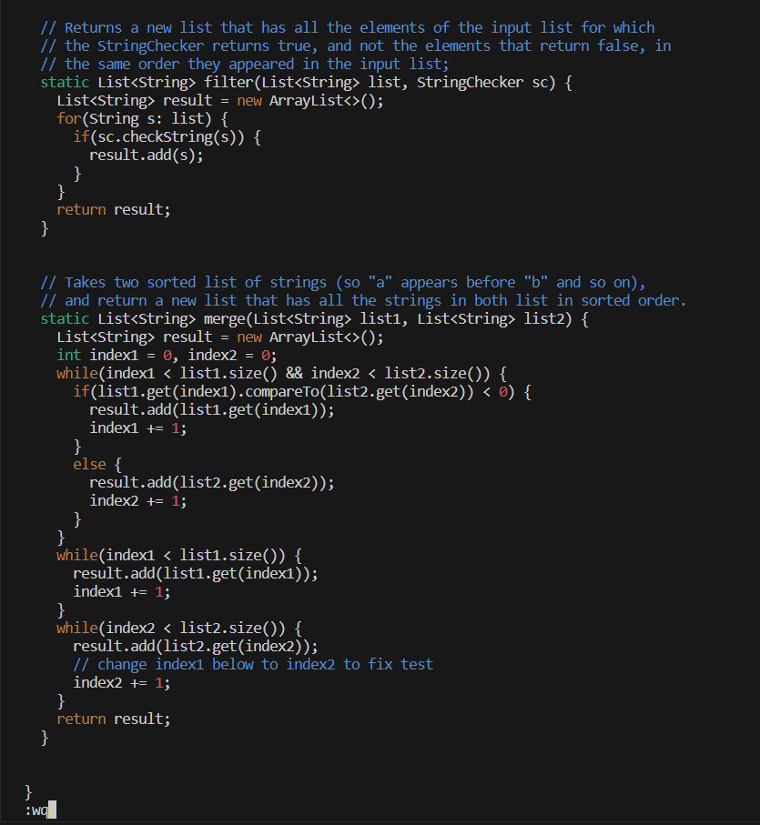
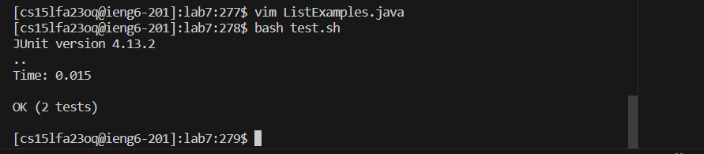
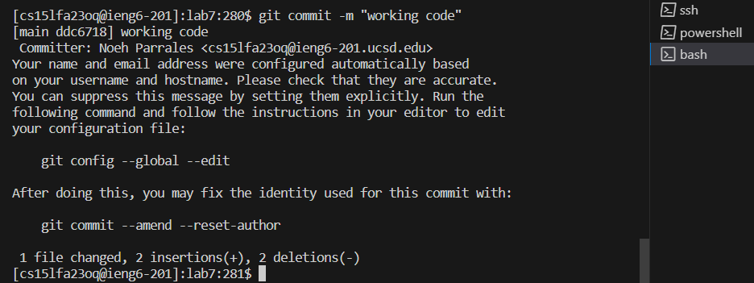
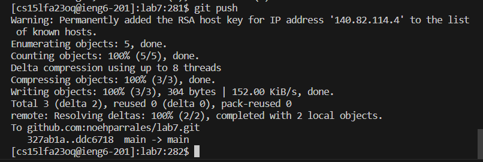

4) Logged into ieng6
   - ssh cs15lfa23oq@ieng6.ucsd.edu + `<enter>`

5) clone the repository using the SSH URL
  - git clone git@github.com:noehparrales/lab7.git + <enter> 

6) test the code
  - bash test.sh + <enter> 

7) edited code using vim
  - first I had to use the command: vim ListExamples.java + <enter>
  - then I pressed <j> 10 times to go to line where one of the problems is at, pressed <l> 16 times to right
  - the first problem was that result.add(0,s) has the 0 which makes the first test case fail 
  -  pressed <x> to delete the unwanted characters
  - from there, I pressed <j> 29 more times to go to the next code issue, and <h> 6 times to go left
  - the next issue is that index1 should be index2
  - go to the unwanted character and press <x>
  - then clicked <i> to add text, replaced it with 2, then pressed <esc> to go back to normal mode.
  - lastly typed the command <:wq> to save the edits 

