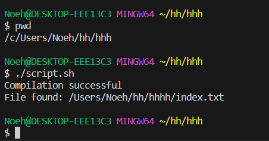

# Part 1 
## Student Post
__Title__
File not found error message 
__Category__
Labs

Hey Im having an issue with this coding assignment of the lab. Im getting a "File not found" error message and I dont understand why. Below is the error and code I have so far. 


2)
# TA Response

Hello! At first glance the issue your having is coming from finding the 'input.txt' file. A few things you could try is making sure youre in the right directory using 'pwd', then ls to see if your directory is where your file is at. If the file is somewhere else, in your code include its absolute path.

If this doesn't work reply to this post, good luck! 

3)
# Student Response



After trying to figure out the issue I did realize that I was looking for a file that was not in the same directory. When I used the command pwd, it showed that I was in the the absolute path /Users/Noeh/hh/hhh, and when I used the command ls, only my h.java file showed and not the index.txt file I was looking for. So in order to fix the issue I had to include the absolute path of where my index.txt file was at. 


4) file and directory structure
   hh
   |    hhh
   |    |    h.java
   |    |    script.sh
   |    hhhh
   |    |    index.txt

   contents of h.java before fixing the bug
   ```
package hhh;
import java.io.File;
import java.io.FileNotFoundException;
import java.util.Scanner;

public class h {

    public static void main(String[] args) {
        h fileSystem = new h();
        fileSystem.readFromFile("index.txt");
    }

    public void readFromFile(String fileName) {
        try {
            File file = new File(fileName);

            if (file.exists() && !file.isDirectory()) {
                System.out.println("File found: " + fileName);
            } else {
                System.out.println("File not found: " + fileName);
                return;
            }

            Scanner scanner = new Scanner(file);

            while (scanner.hasNextLine()) {
                String line = scanner.nextLine();
                processLine(line);
            }

            scanner.close();
        } catch (FileNotFoundException e) {
            System.out.println("File not found: " + e.getMessage());
        }
    }

    public void processLine(String line) {
        System.out.println(line + " " + generateMysteriousCharacters());
    }

    public String generateMysteriousCharacters() {
        return "\u001B[31m???\u001B[0m";
    }
}
```
contents of bash script.sh

```
javac -d . h.java

```
if [ $? -eq 0 ]; then
    echo "Compilation successful"

    java h.java
else
    echo "Compilation failed"
fi
```

contents of index.txt
```
hi
```
__Description__
In order to fix the bug I needed to include the absolute path to the file I was looking for. In the original code I was looking for "index.txt" without actually having it being located in the same directory. So to fix the issue I had to include the path "/Users/Noeh/hh/hhhh/index.txt" at line 10. 


